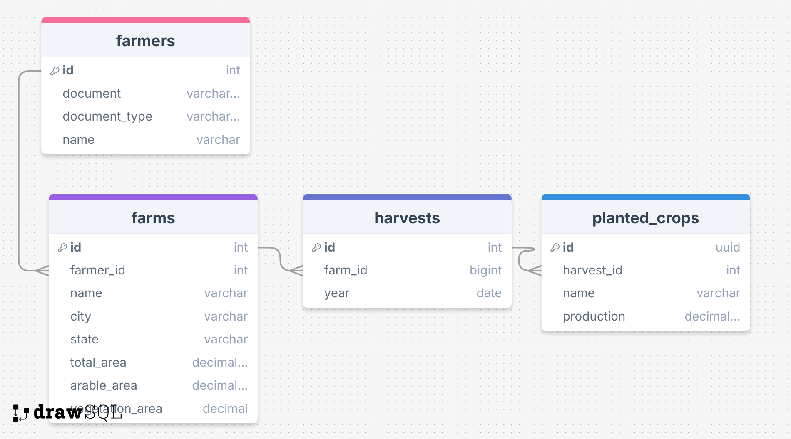

# Farm Manage - Sistema de Gestão de Produtores Rurais

Sistema desenvolvido para gerenciar o cadastro de produtores rurais. O projeto foi construído utilizando **NestJS** (Node.js com TypeScript), **PostgreSQL** como banco de dados, **Prisma ORM** para gerenciamento de dados, **Zod** para validação de dados e **Docker** para containerização.

---

## Funcionalidades

- **Cadastro de Produtores Rurais**: Permite cadastrar, editar e excluir produtores rurais, com validação de CPF/CNPJ.
- **Gestão de Propriedades**: Um produtor pode estar associado a uma ou mais propriedades rurais.
- **Culturas Plantadas**: Registro de culturas plantadas por safra em cada propriedade.
- **Validações de Área**: Garante que a soma das áreas agricultável e de vegetação não ultrapasse a área total da fazenda.
- **Dashboard**: Exibe métricas como:
  - Total de fazendas cadastradas.
  - Total de hectares registrados.
  - Gráficos de pizza por estado, cultura plantada e uso do solo.

---

## Tecnologias Utilizadas

- **Backend**:
  - **NestJS**: Framework para construção de APIs escaláveis e eficientes.
  - **TypeScript**: Linguagem principal do projeto.
  - **Prisma ORM**: ORM para gerenciamento do banco de dados.
  - **PostgreSQL**: Banco de dados relacional.
  - **Zod**: Biblioteca para validação de dados.
  - **Docker**: Para containerização da aplicação e do banco de dados.
  - **Swagger**: Documentação da API.
  - **Jest**: Framework para testes unitários e integrados.

- **Ferramentas**:
  - **Yarn**: Gerenciador de pacotes.
  - **Docker Compose**: Para orquestração dos containers.

---

## Como Rodar o Projeto

### Pré-requisitos

- **Docker** e **Docker Compose** instalados.
- **Node.js** (opcional, caso queira rodar localmente sem Docker).

### Passo a Passo

1. **Clone o repositório**

   Clone este repositório em sua máquina local:

   ```bash
   git clone <URL_do_repositório>
   cd <diretório_do_repositório>
   ```
2. **Configuração das variáveis de ambiente**

   Crie um arquivo .env a partir do .env.example na raiz do projeto:

   ```bash
   cp .env.example .env
   ```
3. **Subir os containers com Docker Compose**
  Execute o comando abaixo para construir as imagens e iniciar os containers:

   ```bash
   docker-compose up --build
   ```

Isso irá:

- Criar o banco de dados PostgreSQL.

- Aplicar as migrações do Prisma.

- Executar o seed do banco de dados (se configurado).

- Iniciar a aplicação NestJS.

## Acessando a API

Após o Docker Compose iniciar os serviços, você pode acessar a documentação da API no Swagger:

- **Swagger UI: http://localhost:3000/api**

Aqui você pode explorar e testar todas as rotas disponíveis.

## Dados Mockados com Prisma Seed
Para facilitar testes e desenvolvimento, o projeto inclui dados mockados gerados com o recurso de db seed do Prisma. Esses dados são inseridos automaticamente no banco de dados ao subir os containers com o Docker Compose. Exemplos de dados mockados incluem produtores rurais, propriedades e culturas plantadas.

## Exemplo de Requisições
Cadastrar um Produtor Rural
POST /farmers

```json
{
  "document": "12345678901",
  "document_type": "CPF",
  "name": "Farmer Name"
}
```
Listar Produtores Rurais
GET /farmers

Resposta esperada:

```json
[
  {
    "id": 1,
    "document": "12345678901",
    "document_type":"CPF",
    "name": "João Silva",
  }
]
```

## Para parar os containers, execute:

```bash
docker-compose down
```

## Testes
O projeto inclui testes unitários e de integração para garantir a qualidade do código. Para rodar os testes, execute:

```bash
yarn test
```

## Modelagem do Banco de Dados
Abaixo está a modelagem do banco de dados utilizada no projeto:




Se precisar de ajuda ou tiver dúvidas, sinta-se à vontade para entrar em contato!

